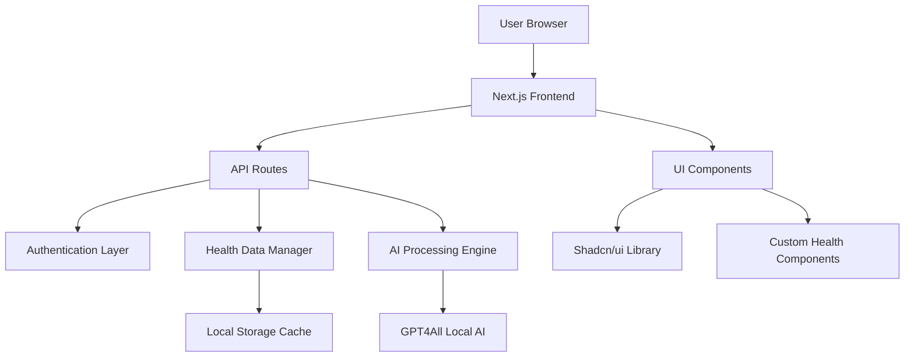

# Zenalytics.ai - Technical Documentation

## Table of Contents
- [Architecture Overview](#architecture-overview)
- [API Reference](#api-reference)
- [Design System](#design-system)
- [AI Integration](#ai-integration)
- [Authentication System](#authentication-system)
- [Data Management](#data-management)
- [Testing](#testing)
- [Deployment](#deployment)
- [Troubleshooting](#troubleshooting)

---

## Architecture Overview

### System Architecture



### Technology Stack

| Layer | Technology | Purpose |
|-------|------------|---------|
| Frontend | Next.js 14 | React framework with App Router |
| Language | TypeScript | Type safety and developer experience |
| Styling | Tailwind CSS | Utility-first CSS framework |
| UI Library | Shadcn/ui | High-quality component library |
| Charts | Recharts | Data visualization library |
| AI Processing | GPT4All | Local AI inference engine |
| State Management | React Hooks + localStorage | Client-side state persistence |
| Authentication | Custom JWT-like system | Secure user authentication |
| Data Storage | Browser localStorage | Client-side data persistence |

### Core Design Principles

1. **Privacy First**: All AI processing happens locally
2. **Performance**: Optimized for fast loading and smooth interactions
3. **Accessibility**: WCAG 2.1 compliant design
4. **Responsiveness**: Mobile-first responsive design
5. **Type Safety**: Full TypeScript implementation
6. **Modularity**: Component-based architecture

---

## API Reference

### Authentication Endpoints

#### POST `/api/auth/login`
Authenticate user or access demo mode.

**Request Body:**
```typescript
{
  email?: string;      // User email (optional for demo)
  password?: string;   // User password (optional for demo)
  isDemo?: boolean;    // Flag for demo mode access
}
```

**Response:**
```typescript
{
  success: boolean;
  user?: User;
  token?: string;
  message?: string;
}
```

**Example:**
```javascript
// Regular login
const response = await fetch('/api/auth/login', {
  method: 'POST',
  headers: { 'Content-Type': 'application/json' },
  body: JSON.stringify({
    email: 'user@example.com',
    password: 'securepassword'
  })
});

// Demo login
const demoResponse = await fetch('/api/auth/login', {
  method: 'POST',
  headers: { 'Content-Type': 'application/json' },
  body: JSON.stringify({ isDemo: true })
});
```

#### POST `/api/auth/register`
Create a new user account.

**Request Body:**
```typescript
{
  name: string;        // User's full name
  email: string;       // Valid email address
  password: string;    // Minimum 6 characters
}
```

**Response:**
```typescript
{
  success: boolean;
  user?: User;
  token?: string;
  message?: string;
}
```

### Health Data Endpoints

#### GET `/api/health/metrics`
Retrieve health metrics for the authenticated user.

**Query Parameters:**
- `userId` (required): User identifier
- `analyze` (optional): Include health analysis

**Response:**
```typescript
{
  success: boolean;
  metrics: HealthMetric[];
  analysis?: HealthAnalysis;
  count: number;
}
```

#### POST `/api/health/metrics`
Add a new health metric.

**Request Body:**
```typescript
{
  userId: string;
  type: 'heart_rate' | 'steps' | 'sleep' | 'weight' | 'blood_pressure' | 'temperature';
  value: number;
  unit: string;
  source: string;
}
```

#### GET `/api/health/insights`
Get AI-generated health insights.

**Query Parameters:**
- `userId` (required): User identifier

**Response:**
```typescript
{
  success: boolean;
  insights: HealthInsight[];
  count: number;
}
```

#### POST `/api/health/insights`
Generate a new AI insight.

**Request Body:**
```typescript
{
  userId: string;
  query?: string;  // Optional specific query
}
```

### AI Chat Endpoint

#### POST `/api/health/chat`
Send message to AI health assistant.

**Request Body:**
```typescript
{
  userId: string;
  message: string;
}
```

**Response:**
```typescript
{
  success: boolean;
  response: string;
  timestamp: Date;
}
```

---

## Design System

### Color Palette

```css
/* Primary Colors */
--cyan-400: #22d3ee;
--cyan-500: #06b6d4;
--blue-500: #3b82f6;
--purple-400: #a855f7;
--purple-500: #8b5cf6;

/* Semantic Colors */
--success: #10b981;
--warning: #f59e0b;
--error: #ef4444;
--info: #3b82f6;

/* Neutral Colors */
--black: #000000;
--gray-900: #111827;
--white: #ffffff;
--white-10: rgba(255, 255, 255, 0.1);
--white-20: rgba(255, 255, 255, 0.2);
```

### Typography

```css
/* Font Family */
font-family: 'Space Grotesk', system-ui, sans-serif;

/* Font Scales */
--text-xs: 0.75rem;     /* 12px */
--text-sm: 0.875rem;    /* 14px */
--text-base: 1rem;      /* 16px */
--text-lg: 1.125rem;    /* 18px */
--text-xl: 1.25rem;     /* 20px */
--text-2xl: 1.5rem;     /* 24px */
--text-3xl: 1.875rem;   /* 30px */
--text-4xl: 2.25rem;    /* 36px */
--text-6xl: 3.75rem;    /* 60px */
```

### Glass Morphism Effects

```css
/* Glass Card */
.glass-card {
  background: rgba(0, 0, 0, 0.4);
  backdrop-filter: blur(20px);
  border: 1px solid rgba(255, 255, 255, 0.1);
  border-radius: 24px;
}

/* Glass Button */
.glass-button {
  background: rgba(255, 255, 255, 0.1);
  backdrop-filter: blur(10px);
  border: 1px solid rgba(255, 255, 255, 0.2);
  border-radius: 16px;
}

/* Gradient Backgrounds */
.gradient-primary {
  background: linear-gradient(135deg, #06b6d4 0%, #3b82f6 100%);
}

.gradient-secondary {
  background: linear-gradient(135deg, #8b5cf6 0%, #a855f7 100%);
}
```

### Component Guidelines

#### Cards
```tsx
// Health metric card structure
<Card className="bg-black/40 backdrop-blur-xl border border-white/10 rounded-[24px] p-6 shadow-2xl">
  <div className="flex items-center justify-between mb-4">
    <Icon className="w-6 h-6 text-cyan-400" />
    <Badge variant="secondary">{trend}</Badge>
  </div>
  <h3 className="text-white text-lg font-medium">{title}</h3>
  <p className="text-3xl font-bold text-white">{value}</p>
  <p className="text-white/60 text-sm">{description}</p>
</Card>
```

#### Buttons
```tsx
// Primary action button
<Button className="bg-gradient-to-r from-cyan-500 to-blue-500 hover:from-cyan-600 hover:to-blue-600 text-white border-0 rounded-2xl">
  {children}
</Button>

// Secondary glass button
<Button className="bg-white/10 hover:bg-white/20 text-white border border-white/20 rounded-2xl backdrop-blur-sm">
  {children}
</Button>
```

### Responsive Breakpoints

```css
/* Mobile First Approach */
--mobile: 0px;        /* Default */
--tablet: 768px;      /* md: */
--desktop: 1024px;    /* lg: */
--wide: 1280px;       /* xl: */
--ultrawide: 1536px;  /* 2xl: */
```

---

## AI Integration

### GPT4All Implementation

The platform uses GPT4All for local AI processing, ensuring user privacy.

```typescript
// AI Processing Flow
class HealthAI {
  async generateInsight(userId: string, query?: string): Promise<HealthInsight> {
    // 1. Gather user's health context
    const metrics = getHealthMetrics(userId);
    const previousInsights = getHealthInsights(userId);
    
    // 2. Analyze patterns and correlations
    const patterns = this.analyzePatterns(metrics);
    
    // 3. Generate personalized insight
    const insight = await this.processWithAI(patterns, query);
    
    // 4. Store and return insight
    return this.createInsight(insight, userId);
  }
  
  private analyzePatterns(metrics: HealthMetric[]): HealthPattern[] {
    // Correlation analysis logic
    // Sleep vs Heart Rate variability
    // Exercise vs Recovery patterns
    // Nutrition vs Energy levels
  }
}
```

### Insight Generation Categories

1. **Correlations**: Relationships between different health metrics
2. **Trends**: Long-term patterns and trajectories
3. **Recommendations**: Actionable advice based on data
4. **Anomalies**: Unusual patterns requiring attention
5. **Predictions**: Future health trends and outcomes

### AI Chat System

```typescript
// Chat response generation
export function generateAIResponse(query: string, metrics: HealthMetric[], insights: HealthInsight[]): string {
  // Context-aware response based on:
  // - User's actual health data
  // - Previous insights
  // - Query intent classification
  // - Personalized recommendations
}
```

---

## Authentication System

### User Management

```typescript
// User interface
interface User {
  id: string;
  email: string;
  name: string;
  createdAt: Date;
  isDemo?: boolean;
}

// Authentication response
interface AuthResponse {
  success: boolean;
  user?: User;
  token?: string;
  message?: string;
}
```

### Demo Mode Implementation

```typescript
// Demo user with pre-populated data
export const DEMO_USER: User = {
  id: 'demo-user-123',
  email: 'demo@healthapp.com',
  name: 'Demo User',
  createdAt: new Date('2024-01-01'),
  isDemo: true
};

// Demo login flow
export async function loginDemo(): Promise<AuthResponse> {
  setCurrentUser(DEMO_USER);
  initializeDemoData(); // Load sample health data
  return { success: true, user: DEMO_USER };
}
```

### Security Considerations

1. **Local Storage**: Sensitive data stored client-side only
2. **No Server State**: Stateless authentication system
3. **Demo Isolation**: Demo users can't access real user data
4. **Input Validation**: All inputs sanitized and validated
5. **XSS Protection**: React's built-in XSS protection

---

## Data Management

### Health Data Models

```typescript
// Health metric structure
interface HealthMetric {
  id: string;
  userId: string;
  type: 'heart_rate' | 'steps' | 'sleep' | 'weight' | 'blood_pressure' | 'temperature';
  value: number;
  unit: string;
  timestamp: Date;
  source: string;  // Device or app that recorded the metric
}

// AI-generated insight
interface HealthInsight {
  id: string;
  userId: string;
  type: 'correlation' | 'trend' | 'recommendation' | 'goal' | 'anomaly';
  title: string;
  description: string;
  confidence: number;  // 0-100 confidence score
  timestamp: Date;
  gpt4allGenerated?: boolean;
}

// Data source connection
interface DataSource {
  id: string;
  name: string;
  connected: boolean;
  lastSync: string;
  dataPoints: number;
  status: 'active' | 'disconnected' | 'error';
}
```

### Data Flow Architecture

```
User Input → Validation → Local Storage → AI Processing → Insights Generation → UI Update
     ↓                                                           ↓
Cache Management ←---------------------------------------------- Analytics
```

### Storage Strategy

1. **Browser localStorage**: Primary data storage
2. **In-memory cache**: Session-based performance optimization
3. **Lazy loading**: Load data as needed
4. **Data persistence**: Automatic save on changes
5. **Cleanup**: Remove expired demo data

---

## Testing

### Testing Strategy

```typescript
// Component testing example
import { render, screen, fireEvent } from '@testing-library/react';
import { HealthDashboard } from '@/components/health/health-dashboard';

describe('HealthDashboard', () => {
  it('displays health metrics correctly', () => {
    render(<HealthDashboard />);
    expect(screen.getByText('Health Overview')).toBeInTheDocument();
  });
  
  it('generates AI insights on button click', async () => {
    render(<HealthDashboard />);
    fireEvent.click(screen.getByText('Generate Insights'));
    expect(await screen.findByText('New insight generated')).toBeInTheDocument();
  });
});
```

### API Testing

```typescript
// API route testing
import { POST } from '@/app/api/health/insights/route';

describe('/api/health/insights', () => {
  it('generates insights for valid user', async () => {
    const request = new Request('http://localhost/api/health/insights', {
      method: 'POST',
      body: JSON.stringify({ userId: 'test-user', query: 'sleep patterns' })
    });
    
    const response = await POST(request);
    const data = await response.json();
    
    expect(data.success).toBe(true);
    expect(data.insight).toBeDefined();
  });
});
```

### Testing Commands

```bash
# Run all tests
npm test

# Run tests in watch mode
npm test:watch

# Run tests with coverage
npm test:coverage

# Run E2E tests
npm test:e2e
```

---

## Deployment

### Environment Variables

```bash
# .env.local (for production)
NEXTAUTH_SECRET=your-secret-key
NEXTAUTH_URL=https://your-domain.com
NODE_ENV=production
```

### Build Process

```bash
# Development build
npm run dev

# Production build
npm run build
npm run start

# Static export (if needed)
npm run build
npm run export
```

### Vercel Deployment

```json
{
  "name": "zenalytics-ai",
  "version": 2,
  "builds": [
    {
      "src": "package.json",
      "use": "@vercel/next"
    }
  ],
  "routes": [
    {
      "src": "/api/(.*)",
      "dest": "/api/$1"
    },
    {
      "src": "/(.*)",
      "dest": "/$1"
    }
  ]
}
```

### Docker Deployment

```dockerfile
FROM node:18-alpine

WORKDIR /app
COPY package*.json ./
RUN npm ci --only=production

COPY . .
RUN npm run build

EXPOSE 3000
CMD ["npm", "start"]
```

### Performance Optimization

1. **Code Splitting**: Automatic route-based splitting
2. **Image Optimization**: Next.js Image component
3. **Bundle Analysis**: webpack-bundle-analyzer
4. **Caching**: Static asset caching
5. **Compression**: Gzip compression enabled

---

## Troubleshooting

### Common Issues

#### 1. Dependencies Not Installing
```bash
# Clear cache and reinstall
rm -rf node_modules package-lock.json
npm cache clean --force
npm install
```

#### 2. TypeScript Errors
```bash
# Check TypeScript configuration
npx tsc --noEmit
npm run type-check
```

#### 3. AI Insights Not Generating
```javascript
// Check user authentication
const user = getCurrentUser();
if (!user) {
  console.error('User not authenticated');
}

// Verify health data exists
const metrics = getHealthMetrics(user.id);
if (metrics.length === 0) {
  console.warn('No health data available for insights');
}
```

#### 4. Demo Mode Issues
```javascript
// Reset demo data
localStorage.removeItem('health_app_current_user');
localStorage.removeItem('health_app_metrics');
localStorage.removeItem('health_app_insights');

// Reload page to reinitialize
window.location.reload();
```

### Debug Mode

```bash
# Enable debug logging
DEBUG=zenalytics:* npm run dev

# Check browser console for errors
# Open DevTools → Console
```

### Performance Issues

```javascript
// Monitor component renders
import { Profiler } from 'react';

function onRenderCallback(id, phase, actualDuration) {
  console.log('Component render:', { id, phase, actualDuration });
}

<Profiler id="HealthDashboard" onRender={onRenderCallback}>
  <HealthDashboard />
</Profiler>
```

### Getting Help

1. **GitHub Issues**: [Report bugs or request features](https://github.com/arjunprograms/Zenalytics.ai/issues)
2. **Documentation**: Check this documentation first
3. **Community**: Join our Discord server
4. **Email Support**: technical@zenalytics.ai

---

## API Client Usage Examples

### Frontend Integration

```typescript
// Using the API client
import { healthInsightsApi, healthMetricsApi, aiChatApi } from '@/lib/api';

// Get user insights
const { data: insights } = await healthInsightsApi.getInsights();

// Add health metric
await healthMetricsApi.addMetric('heart_rate', 72, 'bpm', 'Apple Watch');

// Chat with AI
const { data: response } = await aiChatApi.sendMessage('How is my sleep quality?');
```

### Error Handling

```typescript
try {
  const result = await healthInsightsApi.generateInsight();
  if (result.success) {
    // Handle success
    setInsights(prev => [result.data.insight, ...prev]);
  } else {
    // Handle API error
    toast.error(result.error || 'Failed to generate insight');
  }
} catch (error) {
  // Handle network error
  toast.error('Network error. Please try again.');
}
```

---

## Performance Benchmarks

### Core Web Vitals Targets

- **First Contentful Paint (FCP)**: < 1.5s
- **Largest Contentful Paint (LCP)**: < 2.5s
- **First Input Delay (FID)**: < 100ms
- **Cumulative Layout Shift (CLS)**: < 0.1

### Bundle Size Targets

- **Initial Bundle**: < 200KB gzipped
- **Total JavaScript**: < 500KB gzipped
- **CSS**: < 50KB gzipped
- **Images**: WebP format, optimized sizes

---

This documentation provides comprehensive technical details for developers working with Zenalytics.ai. For user-facing information, see the [README.md](./README.md) file.
